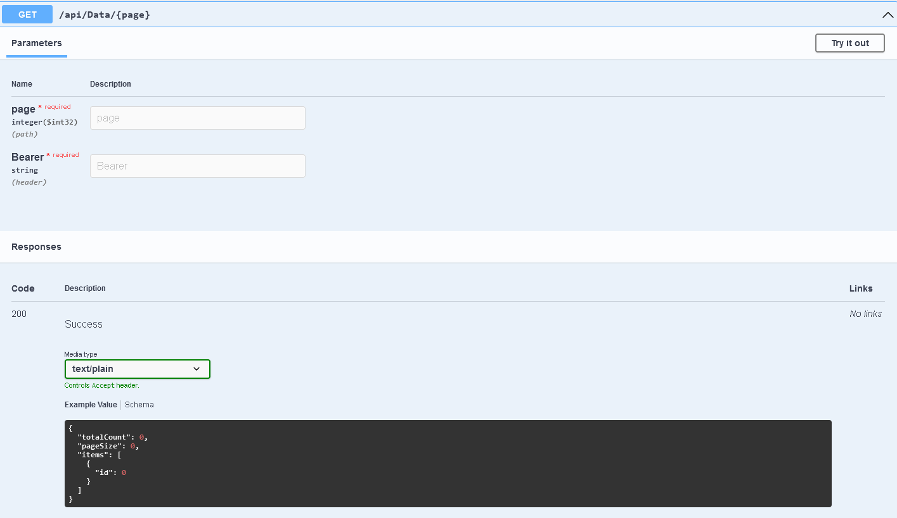
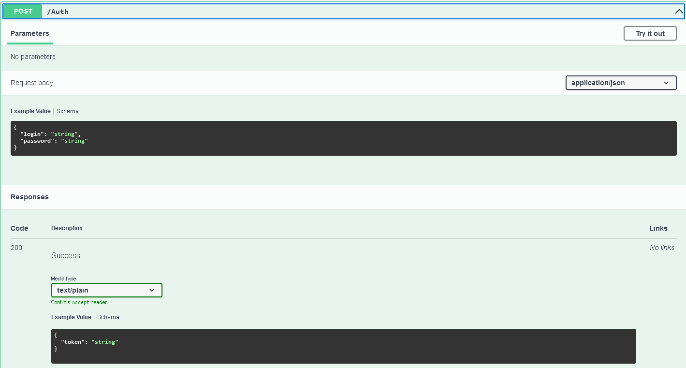

# Power BI - API with Pagination Data Source

The example demonstrates how to obtain data from API endpoint with pagination for Power BI that supports scheduled refresh in Power BI Service. The **example.pbix** file contains implementation for [https://openlibrary.org](https://openlibrary.org) API that obtains **Software Architecture** books

## How it works
The data querying is defined in **GetDataFromApiWithPagination** function:

``` M
let
    Source = () =>
    let
        domain = "https://openlibrary.org",   
        pageSize = 100,   
        GetPageResponse = (pageNumber) =>
        let
            pageResponse = Json.Document(Web.Contents(domain, 
                    [
                        RelativePath = "search.json?q=software+architecture&page=" & Text.From(pageNumber) & "&limit=" & Text.From(pageSize)
                    ]
                )
            )
        in
            pageResponse,      
        firstPageResponse = GetPageResponse(1),
        totalPages = Number.RoundUp(firstPageResponse[numFound] / pageSize),
        GetPageData = (pageResponse) => pageResponse[docs],
        dataList = if totalPages < 2 
                    then GetPageData(firstPageResponse) 
                    else List.Combine({GetPageData(firstPageResponse),
                            List.Union(List.Transform({2 .. totalPages}, 
                                    each GetPageData(GetPageResponse(_))))}),
        tableFromList = Table.FromList(dataList, Splitter.SplitByNothing(), null, null, ExtraValues.Error)
    in
        tableFromList
in
    Source
```

### Key points of the function

``` M
domain = "https://openlibrary.org",   
pageSize = 100, 
```

These are configuration variables to define the API domain and number of items returned per single API request.

``` M
GetPageResponse = (pageNumber) =>
let
    pageResponse = Json.Document(Web.Contents(domain, 
            [
                RelativePath = "search.json?q=software+architecture&page=" & Text.From(pageNumber) & "&limit=" & Text.From(pageSize)
            ]
        )
    )
in
    pageResponse, 
```

**GetPageResponse** is a local function that will return a response for single request to API endpoint for specific **pageNumber**.

``` M
firstPageResponse = GetPageResponse(1),
totalPages = Number.RoundUp(firstPageResponse[numFound] / pageSize),
```

This is a calculation for total number of requests to API endpoint to get data from all pages. **firstPageResponse[numFound]** in API response defines the total number of records that API has for the query **q=software+architecture**.

``` M
GetPageData = (pageResponse) => pageResponse[docs],
```

**GetPageData** is a local function that returns the list of data records from the response. Needed this function to avoid duplication of code.

``` M
dataList = if totalPages < 2 
        then GetPageData(firstPageResponse) 
        else List.Combine({GetPageData(firstPageResponse),
                List.Union(List.Transform({2 .. totalPages}, 
                        each GetPageData(GetPageResponse(_))))}),
```

This is the part where data is loaded from the API.

``` M
if totalPages < 2 
        then GetPageData(firstPageResponse) 
```

There is no need for additional calls to API if there is data only for a single page (or no data at all). In this case - only data from the first request will be used further.

``` M
else List.Combine({GetPageData(firstPageResponse),
        List.Union(List.Transform({2 .. totalPages}, 
                each GetPageData(GetPageResponse(_))))})
```

This part combines data from the first response and does additional requests to API for all remaining pages. 

``` M
{2 .. totalPages}
```

Generates the List of numbers starting from 2 and ending with the last page number.

``` M
List.Transform({2 .. totalPages}, 
                each GetPageData(GetPageResponse(_))
```

Iterates through list of page numbers and for each number calls the API endpoint for a specific page number and returns data from the response. Since **List.Transform** returns List of List - need to wrap it into **List.Union**.

You can further decorate the function with own parameters (i.e. API version, query parameters) and further reuse it to obtain data from multiple endpoints of same API.

## Example for API that requires authentication

Assuming you are required to use the following API endpoint as a data source:



The data will be returned as paginated list containing the meta-data about total available records (totalCount) and number of items in the page (pageSize). The URL parameter **page** defines the data batch to return. For example:

If **totalCount: 325**, **pageSize: 100**

Request to **/api/data/1** will return items from 1 to 100,  **/api/data/2** - items from 101 to 200, **/api/data/3** - items from 201 to 300, **/api/data/4** - items from 301 to 325

The endpoint also requires **Bearer** authentication parameter to be provided in the request header. The parameter must be obtained first from the following endpoint:



The following modification of the function will do the job:

``` M
let
    Source = () =>
    let
        domain = "https://domain.com",
        login = "theLogin",
        password = "thePassword",
        authRequestBody = "{
        ""login"": """ & login & """,
        ""password"": """ & password & """
        }",
        authResponse = Json.Document(Web.Contents(domain, 
                [
                    RelativePath = "api/auth",
                    Headers=[#"Content-Type"="application/json"], 
                    Content=Text.ToBinary(authRequestBody)
                ]
            )
        ),
        accessToken = authResponse[token],
        GetPageResponse = (pageNumber) =>
        let
            pageResponse = Json.Document(Web.Contents(domain, 
                    [
                        RelativePath = "api/data/" & Text.From(pageNumber),
                        Headers=[#"Content-Type"="application/json", #"Bearer"=accessToken]
                    ]
                )
            )
        in
            pageResponse,

        firstPageResponse = GetPageResponse(1),
        totalPages = Number.RoundUp(firstPageResponse[totalCount] / firstPageResponse[pageSize]),
        GetPageData = (pageResponse) => pageResponse[items],
        dataList = if totalPages < 2 
                    then GetPageData(firstPageResponse) 
                    else List.Combine({GetPageData(firstPageResponse),
                            List.Union(List.Transform({2 .. totalPages}, 
                                    each GetPageData(GetPageResponse(_))))}),
        tableFromList = Table.FromList(dataList, Splitter.SplitByNothing(), null, null, ExtraValues.Error)
    in
        tableFromList
in
    Source
```

You can further decorate the function with own parameters (i.e. API version, query parameters, request body parameters) and further reuse it to obtain data from multiple endpoints of same API.

## References

Search for a M language functions definitions at [https://learn.microsoft.com/en-us/powerquery-m/](https://learn.microsoft.com/en-us/powerquery-m/) for additional information or specifications of any provided bit of code.